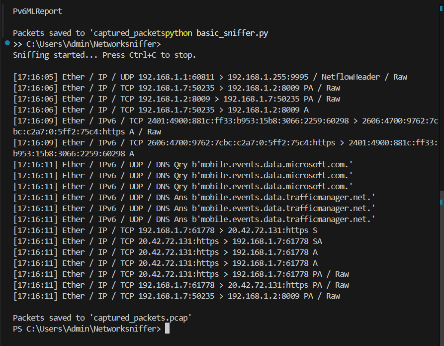
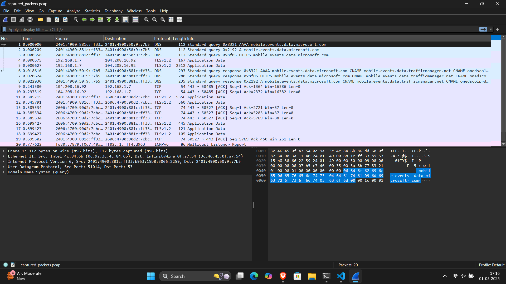

# 📡 Network Sniffer using Python and Scapy

# 🛡️ CodeAlpha Internship – Task 1: Basic Network Sniffer

## 👨‍💻 Project Overview
This project is a basic network packet sniffer built using Python and Scapy.  
It captures and displays live network traffic on the device, showing protocol details and saving captured packets to a `.pcap` file (compatible with Wireshark).

## 🧰 Technologies Used
- Python 3.12
- Scapy
- Npcap (for packet capture)
- VS Code
- Wireshark (for packet analysis)

## 📂 How It Works
- Captures 20 packets using Scapy
- Prints packet summary with timestamp
- Saves all packets to `captured_packets.pcap`

## ▶️ Sample Output (Terminal)
Sniffing started... Press Ctrl+C to stop.

[13:42:01] Ether / IP / TCP 192.168.1.7:50485 > 104.208.16.92:https PA / Raw
[13:42:01] Ether / IP / TCP 104.208.16.92:https > 192.168.1.7:50485 A

## 📸 Screenshots

### ✅ Terminal Output

### 🐬 Wireshark View

## 📁 Files Included
- `basic_sniffer.py` – main Python script
- `captured_packets.pcap` – captured packets (open in Wireshark)
- `README.md` – project details

## 🙋‍♂️ Created By
- Mahek Sheikh 
- CodeAlpha Cybersecurity Internship  
- Task 1 of 3 Completed ✅

# CodeAlpha_NetworkSniffer
Task 1 of CodeAlpha Cybersecurity Internship – Basic Network Sniffer in Python
>>>>>>> 0f7f808a9794d572e800667501c055c816c7080d
